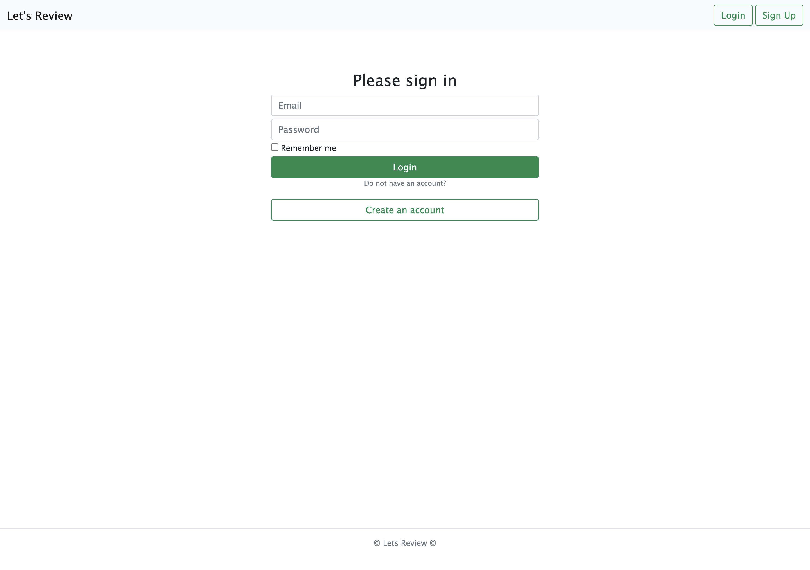
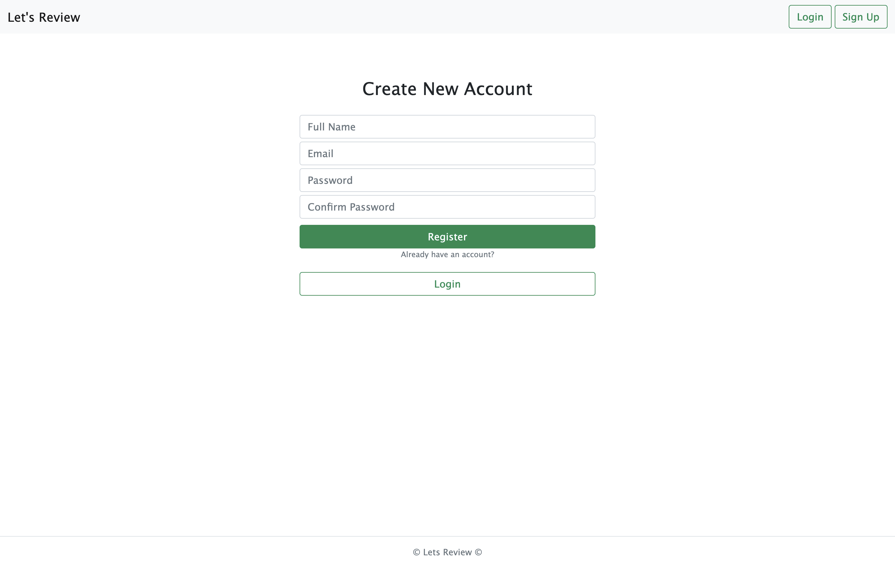
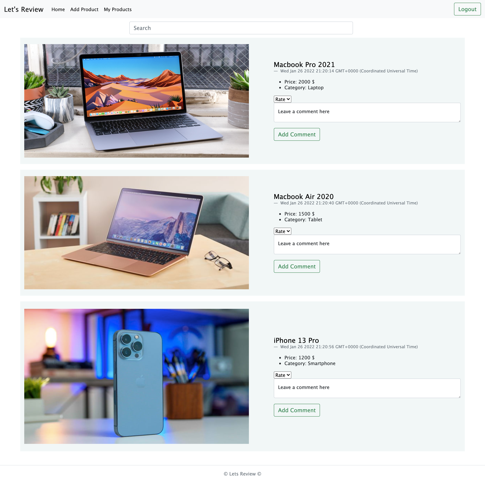
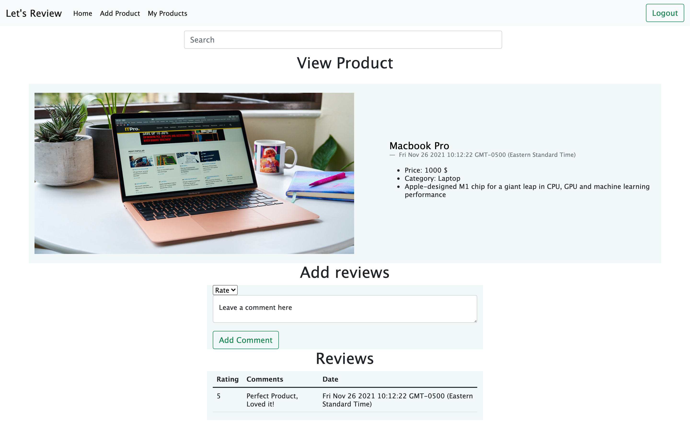
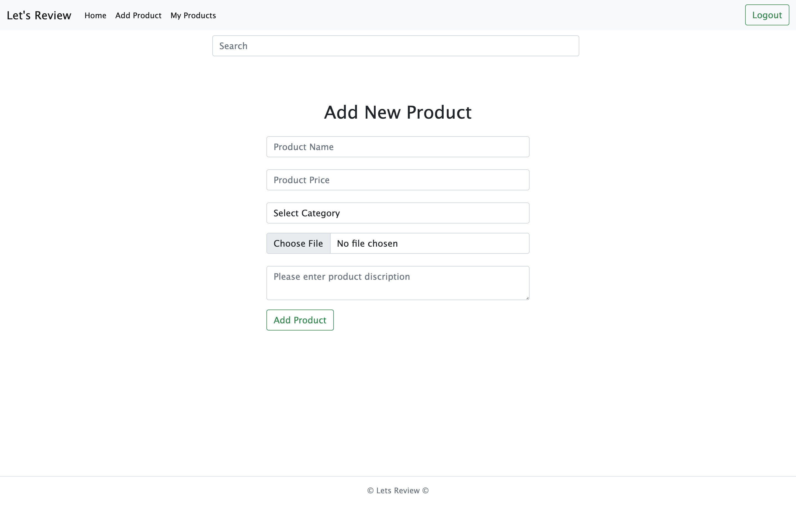
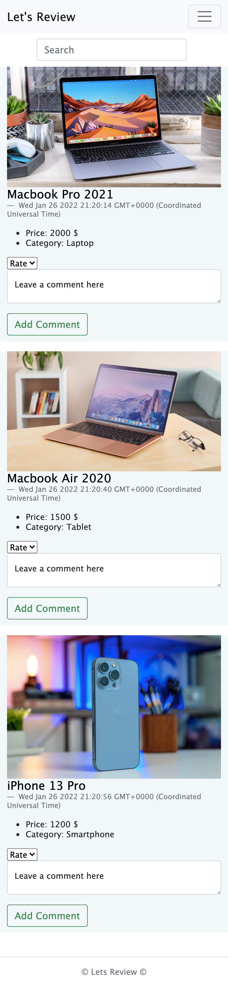
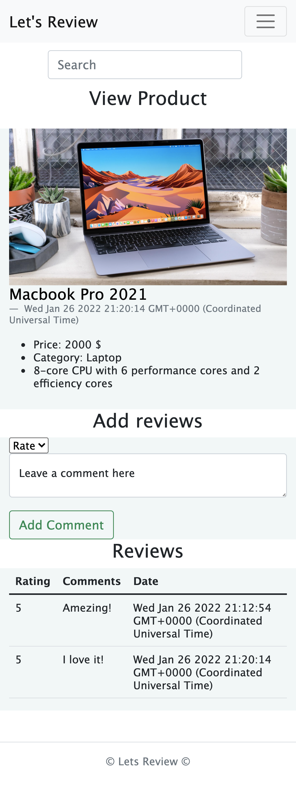

# Lets Review Full Stack Web App

Lets Review is a full stack web app, where users post their products and get reviews and feedbacks from other users.

---

## **Getting Started**

Here is a [Link](https://lets-review.herokuapp.com/) to Let's review!

## Technologies Used

- HTML
- CSS
- EJS
- Bootstrap
- JavaScript
- Node.js
- Express.Js
- MongoDB
- Mongoose
- Heroku
- Mongodb Atlas

---

## Added Features

### Registration / Login

Users have to be registerd and login to get access and upload products.

### Add Product

Users can upload products to get reviews.

- Product Name
- Product Price
- Product Image
- Product category
- Product Description

### View Products and add reviews

Users can add reviews

- Comment
- Rating

### Delete Products

Users can delete there products

---

### Edit Products

Users can Edit there products

---

## Screenshot

- [Login Page](#login-Page)
- [Registration Page](#registration-Page)
- [Home Page](#home-page)
- [Product View Page](#product-view-page)
- [Add Product Page](#add-product-page)

## iPhone 12 Pro - Screenshot

- [Home Page](#home-page-mobile)
- [Product View Page](#product-view-page-mobile)

### Login Page

### Registration Page

### Home Page

### Product View Page

### Add Product Page

### Home Page Mobile

### Product View Page Mobile

## **Getting Started**

Here is a [Link](https://lets-review.herokuapp.com/) to Let's review! Enjoy!

---

## **Next Steps**
